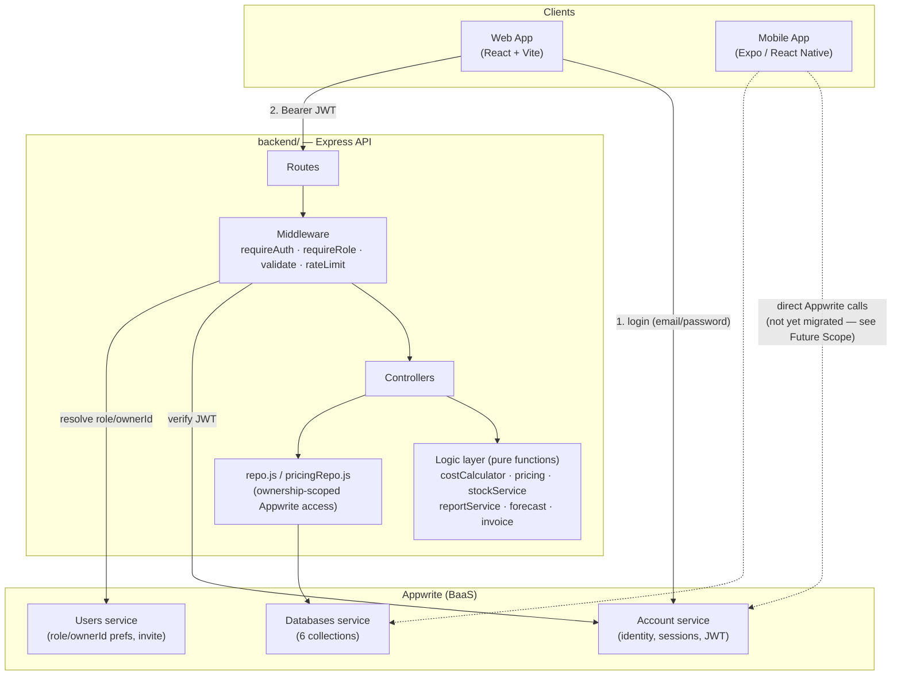
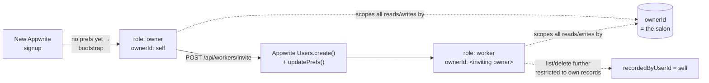
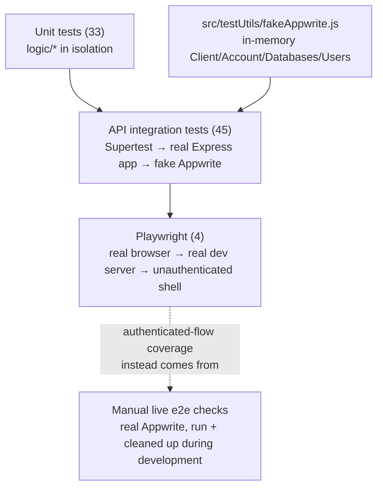

# System Architecture

## 1. High-level overview



**Why this shape, not a thinner client-talks-to-Appwrite-directly design
(which is what the app looked like before Phase 1):** every business rule
— what a service costs, what to charge, how much stock is left, who's
allowed to see what — has to be enforced somewhere a client can't route
around it. Appwrite's document permissions could theoretically do some of
this, but RBAC this specific (an Owner and their invited Workers sharing
one tenant's data, with different visibility) and derived-not-stored data
(stock, forecasts) needs actual code, not database configuration. The
Express layer is that code.

## 2. Layering inside `backend/`

```
routes/        → wires middleware + a schema + a controller to a path
controllers/   → HTTP concerns only (req/res, status codes)
logic/         → pure functions, zero HTTP/Appwrite knowledge, unit-tested
repo.js        → the only place that talks to Appwrite's Databases service
config/        → env loading, the Appwrite server client
middleware/    → auth, RBAC, validation, error handling, rate limiting
```

The controller/logic split is deliberate: `logic/costCalculator.js`,
`logic/stockService.js`, `logic/pricing.js`, `logic/reportService.js`, and
`logic/forecast.js` take plain JS objects/arrays in and return plain JS
objects out. None of them import Express or the Appwrite SDK. That's what
let Phase 0's 13 tests (and later 33) run in milliseconds with no mocking
at all, before any HTTP-layer testing existed — and it's what let Phase 5
add 45 more integration tests on top without touching this layer.

## 3. Tenancy & RBAC model



Every collection document carries a `userID` field that means **the
salon**, not **whoever created it** — that distinction is what makes an
Owner and their Workers share one dataset. A second field,
`recordedByUserId` (added to `service_record` only, in Phase 2), captures
the actual actor, so a Worker's own list can be filtered to just their
records while the Owner still sees everything.

## 4. Data flow: computed, not stored

Stock and forecasts are two places this system deliberately avoids
storing a number that could drift from reality:

- **Stock** = `Σ restock_history.quantityAdded` − `Σ product usage implied
  by service_record × the catalog's per-service product quantities`,
  recomputed on every request ([`stockService.js`](../backend/src/logic/stockService.js)).
  There is no `currentStock` field anywhere that a bug could leave stale.
- **Forecasts** = linear regression (or a naive carry-forward under 3
  months of history) over the same historical documents
  ([`forecast.js`](../backend/src/logic/forecast.js)) — again, nothing
  cached that could go stale.

## 5. Why Appwrite stays, instead of a fully custom database

Appwrite continues to provide identity (accounts, sessions, JWTs) and
document storage. The backend uses Appwrite's **server SDK** with a
secret API key — a privileged connection a browser never has — rather
than routing client requests straight to Appwrite's client SDK, which is
what the original app did. This kept Phases 1–4 fast to build (no
auth system or database engine to write from scratch) while still moving
100% of business-rule enforcement into code the client can't bypass. See
[`docs/PROJECT_REPORT.md`](PROJECT_REPORT.md#5-system-design) §5 for the fuller
design-tradeoff discussion.

## 6. Testing architecture


