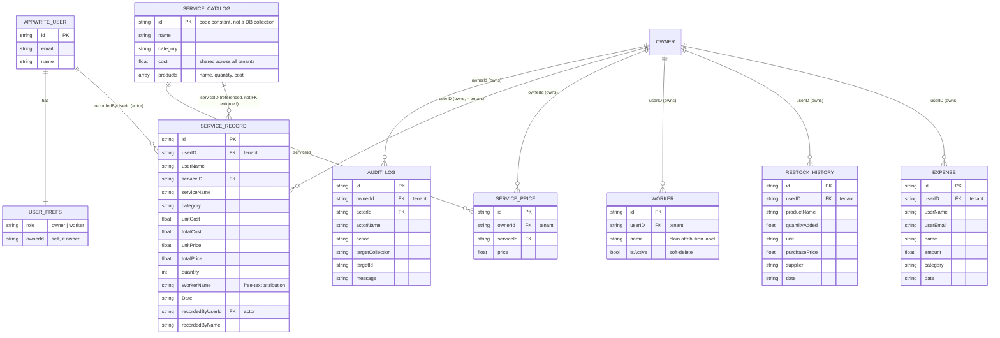

# Data Model (ER Diagram)

Appwrite is a document database, not relational — there are no foreign
keys or joins enforced by the database itself. The relationships below
are enforced entirely in application code (`backend/src/repo.js` and the
controllers), by convention on the `userID` (tenant/owner) and
`recordedByUserId` (actor) fields. This diagram documents that
*application-level* schema, which is the real contract even though
Appwrite itself won't enforce it.

## Notes

- **`SERVICE_CATALOG` is not an Appwrite collection.** It's a code
  constant ([`backend/src/data/servicesCatalog.js`](../backend/src/data/servicesCatalog.js))
  — 83 entries, shared by every tenant, changed only by a code deploy.
  This is intentional: product-usage cost is a recipe, not
  salon-specific data.
- **`WORKER` (plain attribution name) and an invited login are two
  different things that happen to share the word "worker".** A `WORKER`
  document has no connection to an Appwrite account — it's just a label
  a service record's `WorkerName` field can reference. An invited login
  is an actual `APPWRITE_USER` with `role: worker` in its prefs. Nothing
  currently links the two (an owner could invite a login for "Ravi" and
  separately have a `WORKER` attribution entry also named "Ravi" — see
  [`docs/PROJECT_REPORT.md`](PROJECT_REPORT.md#11-future-scope) Future Scope for the case
  to unify them).
- **Six real Appwrite collections** as of Phase 4:
  `expenses`, `service_record`, `restock_history`, `workers`,
  `service_prices`, `audit_log`. Two of these (`restock_history`,
  `workers`) did not actually exist in the live project until Phase 2's
  schema-setup script discovered and created them — see the project
  report for that finding.
