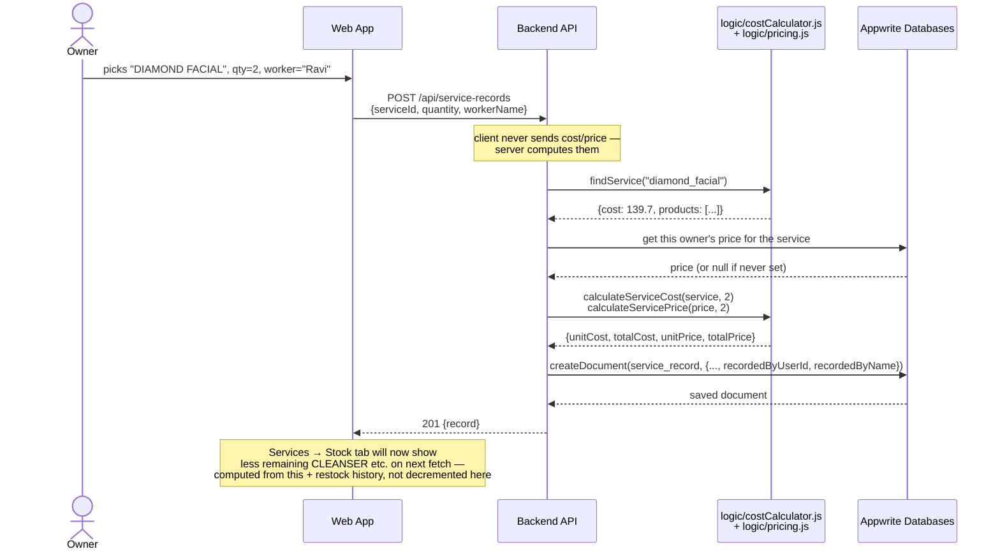
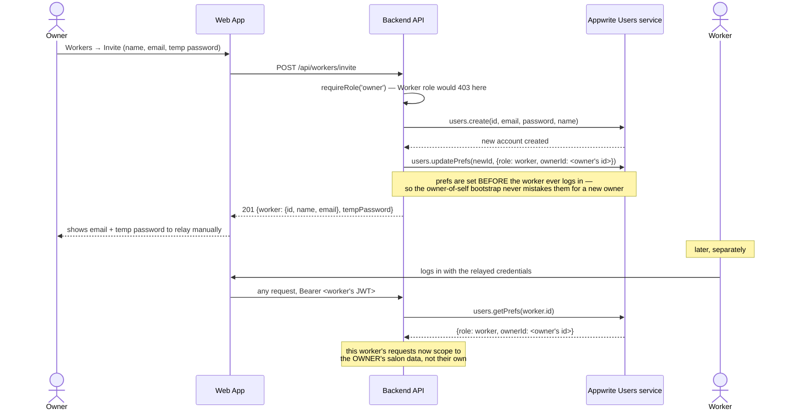
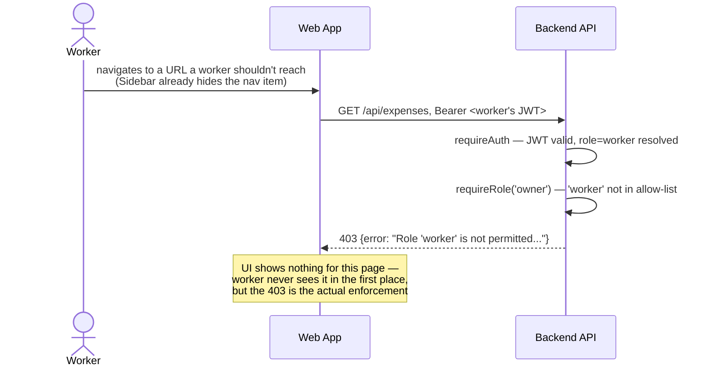

# Key Flows (Sequence Diagrams)

## 1. Login and an authenticated API call

```mermaid
sequenceDiagram
    actor U as User
    participant W as Web App
    participant A as Appwrite (Account service)
    participant B as Backend API
    participant D as Appwrite (Databases/Users)

    U->>W: enters email + password
    W->>A: createEmailPasswordSession()
    A-->>W: session cookie
    W->>A: account.get()
    A-->>W: identity {id, email, name}
    W->>A: account.getPrefs()
    A-->>W: {} (or {role, ownerId} if returning)

    Note over W: user navigates the app;<br/>every backend call needs a JWT

    W->>A: account.createJWT()  (cached ~10 min)
    A-->>W: short-lived JWT
    W->>B: GET /api/services<br/>Authorization: Bearer &lt;jwt&gt;
    B->>A: account.get()  [verify JWT is real]
    A-->>B: identity confirmed
    B->>D: users.getPrefs(identity.id)
    alt no prefs yet
        D-->>B: 404
        B->>D: users.updatePrefs({role: owner, ownerId: self})
        Note over B: bootstrap: a fresh signup becomes<br/>owner of their own new salon
    else prefs exist
        D-->>B: {role, ownerId}
    end
    B-->>W: 200 {services: [...]}
```

## 2. Recording a service (cost/price computed server-side)



## 3. Owner invites a worker



## 4. RBAC rejection (a Worker hits an owner-only route)


